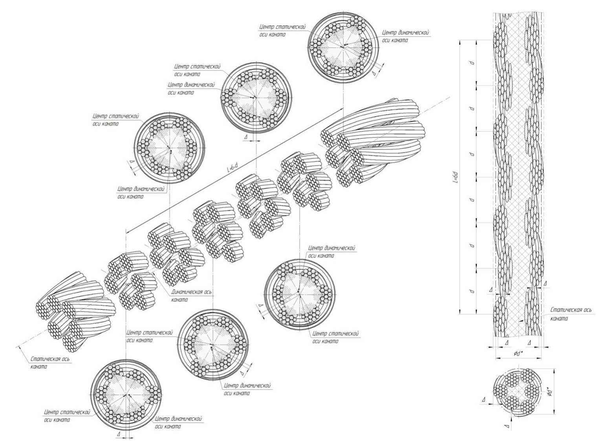

# Детальная оценка поверхности троса

## Типы дефектов
    
- Нарушение геометрии каната: увеличение/уменьшение диаметра, деформация в виде волнистости;

- Аномальные структурные деформации поверхности каната: обрывы наружных проволок, поверхностный износ и повреждения в результате температурного воздействия или электрического дугового разряда;

## Способы анализа дефектов

### Нарушение геометрии каната

- Исходное трехканальное изображение текущего кадра преобразуется в одноканальное изображение в оттенках серого.

- Выделяются контуры краев каната.

- Формируются проекции динамической и статической осей каната на плоскость изображения.

**Динамическая ось** - проходит через центры масс поперечных сечений по длине с учётом наличия технологических эксплуатационных отклонений.

**Статическая ось** - на рисунке выше является усредненной прямой точек центра тяжести всех сечений по длине каната.